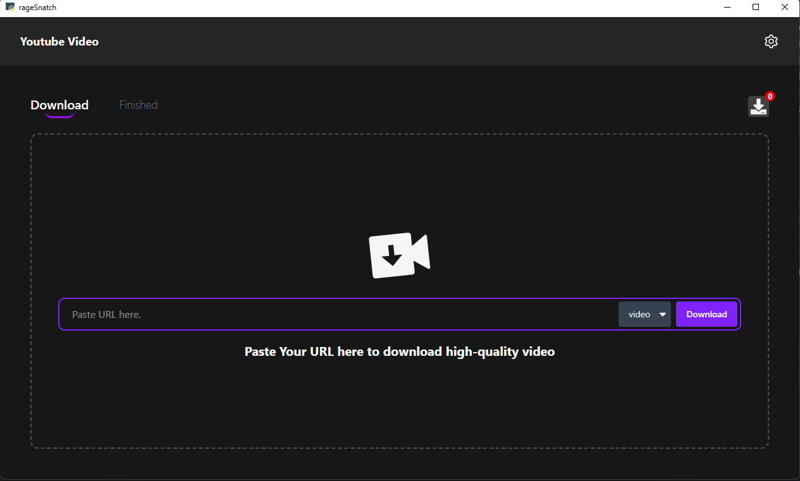
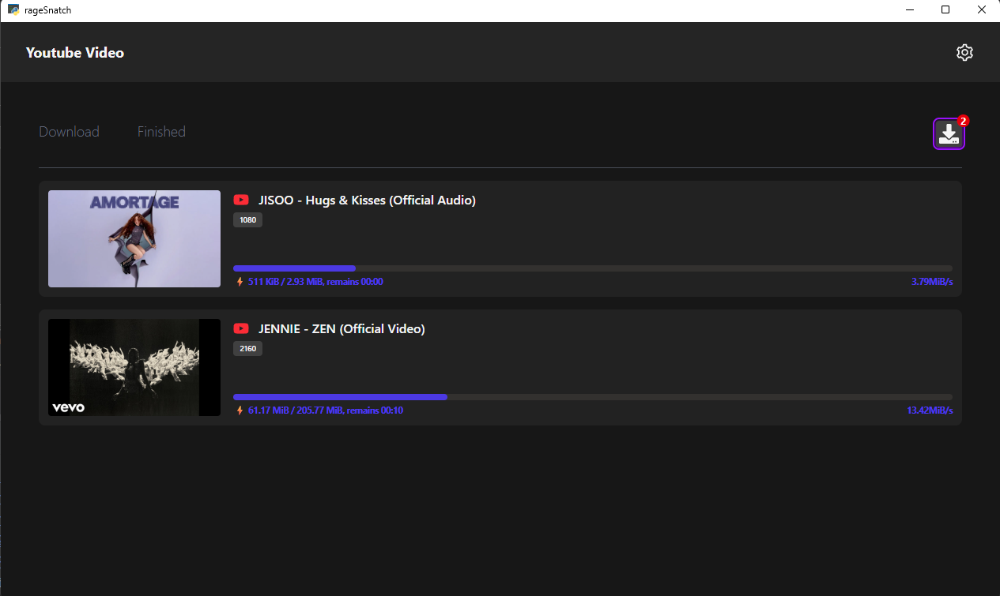
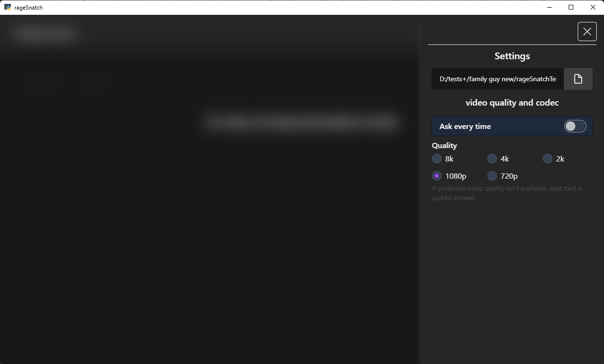
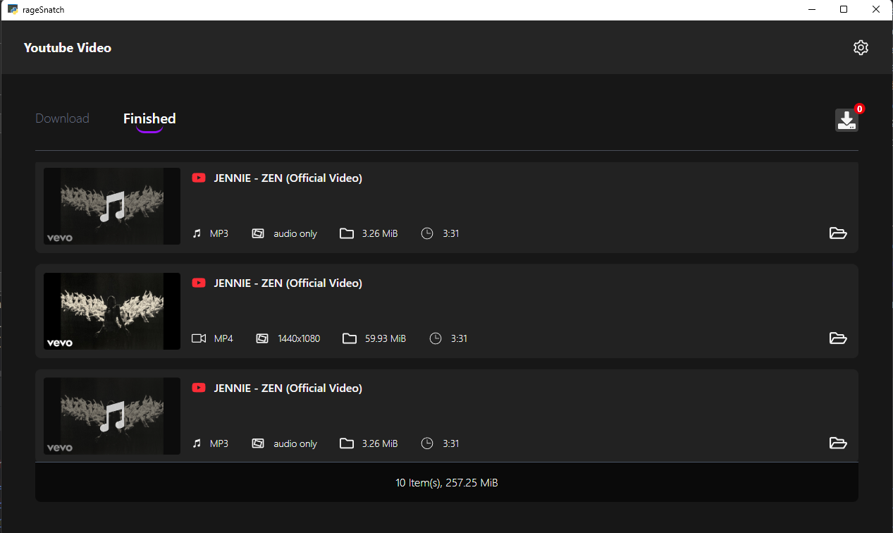

# In Progress [80%]
# GravityBlu
###(rageSnatch previously)
1. A YouTube downloader GUI built with pywebview and yt-dlp

## Parallel Downloads

## Known Issues
- [x] ~~Fix a minor bug: downloading two videos with the same ID causes their progress trackers to collide,
this will be addressed in a future release.~~

- [x] ~~if user changes quality then the downloaded video is not the same quality the user chose even if the
video's res is available ie due to init/variable being read during init phase and that being accessed everytime and not the current quality that the user selected!~~

- [ ] sometimes video download just doesn't start you might have to re-try.
  - SABR forcing error
  - formats skipped due to SABR

## Missing Features
- currently you cannot download age restricted videos
  - cookies auth has not been implemented yet

- [x] ~~youtube to mp3~~
- [ ] direct app updates
- [ ] youtube tags extractor
- [ ] download thumbnails

## Tech stack used
1. Tailwind Css
2. pywebview (python lib)
3. React (vite) + Zustand
4. sqlite
5. yt-dlp (Core of the app)
6.

#### dev notes
- [ ] implement updating feature to app
- [ ]

